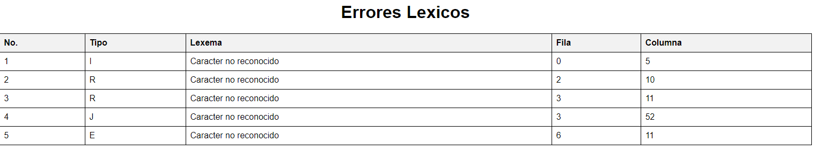

# Autómata para el Análisis Léxico de Archivos .org

Este documento describe el funcionamiento del autómata implementado en Fortran para el análisis léxico de archivos con formato **.org.** El objetivo del autómata es recorrer el contenido del archivo y clasificar los diferentes lexemas presentes en el mismo.

## Estados del Autómata

1. **Estado Inicial** (0): El autómata se encuentra en este estado al inicio del análisis y cada vez que se encuentra un salto de línea.
   Estado de Identificador (1): Este estado se activa cuando se detecta el inicio de un identificador (letras minúsculas).
2. **Estado de Símbolo** (2): Este estado se activa cuando se detecta un símbolo relevante.
3. **Estado de Cadena** (3): Este estado se activa cuando se detecta el inicio de una cadena de texto (comillas dobles).
4. **Estado de Número** (4): Este estado se activa cuando se detecta el inicio de un número.
5. **Estado de Comentario** (5): Este estado se activa cuando se detecta el inicio de un comentario.
6. **Estado de Espacio** en Blanco (6): Este estado se activa cuando se detecta un espacio en blanco.
7. **Estado de Error** (7): Este estado se activa cuando se detecta un carácter no reconocido.

## Metodo del arbol

Para generar el automata necesario para el analizador lexico del proyecto se utilizo el metodo del arbol generando el siguente arbol, siendo el siguiente.


## Descripción del Código

### Estrucutura del codigo


### Inicialización y Lectura del Archivo

El código comienza leyendo el contenido del archivo y almacenándolo en una cadena llamada contenido. Luego, se cierra el archivo y se guarda la longitud de la cadena.

```
if (iostat /= 0) exit
contenido = trim(contenido) // trim(buffer) // char(10)
end do

longitud = len_trim(contenido)
close(unit=unidad)

```

### Recorrido del Contenido del Archivo

```
do while (k <= longitud)
    charLinea = contenido(k:k)
    select case (state)
```

#### Estado Inicial (0)

En el estado inicial, el autómata realiza las siguientes acciones:

- Si encuentra un salto de línea **(char(10))**, incrementa el contador de líneas y reinicia el contador de columnas.
- Si encuentra una letra minúscula **(a a z)**, cambia al estado de identificador **(1)** y almacena el carácter actual en current_lexema.
- Si encuentra un símbolo relevante, cambia al estado de símbolo **(2)** y almacena el carácter actual en current_lexema.
- Si encuentra una comilla doble **(char(34))**, cambia al estado de cadena **(3)** y almacena el carácter actual en current_lexema.
- Si encuentra un dígito **(0 a 9)**, cambia al estado de número **(4)** y almacena el carácter actual en current_lexema.
- Si encuentra un carácter de comentario, cambia al estado de comentario **(5)** y almacena el carácter actual en current_lexema.
- Si encuentra un espacio en blanco, cambia al estado de espacio en blanco **(6)** y almacena el carácter actual en current_lexema.
- Si encuentra un carácter no reconocido, cambia al estado de error **(7)** y almacena el carácter actual en current_lexema.

```
case (0)
    if (charLinea == char(10)) then
        linea_actual = linea_actual + 1
        columna_actual = 1
    else if (charLinea >= 'a' .and. charLinea <= 'z') then
        state = 1
        current_lexema = charLinea
    else if (any(charLinea == relevant_chars)) then
        state = 2
        current_lexema = charLinea
    else if (charLinea == char(34)) then
        state = 3
        current_lexema = charLinea
    else if (charLinea >= '0' .and. charLinea <= '9') then
        state = 4
        current_lexema = charLinea
    else if (charLinea == '#') then
        state = 5
        current_lexema = charLinea
    else if (charLinea == ' ') then
        state = 6
        current_lexema = charLinea
    else
        state = 7
        current_lexema = charLinea
```

#### Estado de Identificador (1)

En este estado, el autómata continúa leyendo caracteres que forman parte del identificador hasta que encuentra un carácter que no sea una letra minúscula.

#### Estado de Símbolo (2)

En este estado, el autómata continúa leyendo caracteres que forman parte del símbolo hasta que encuentra un carácter que no sea relevante.

#### Estado de Cadena (3)

En este estado, el autómata continúa leyendo caracteres hasta encontrar otra comilla doble, indicando el final de la cadena.

#### Estado de Número (4)

En este estado, el autómata continúa leyendo caracteres que forman parte del número hasta que encuentra un carácter que no sea un dígito.

#### Estado de Comentario (5)

En este estado, el autómata continúa leyendo caracteres hasta el final de la línea, indicando el final del comentario.

#### Estado de Espacio en Blanco (6)

En este estado, el autómata continúa leyendo caracteres hasta encontrar un carácter que no sea un espacio en blanco.

#### Estado de Error (7)

En este estado, el autómata registra un error y continúa con el siguiente carácter.

### Reporte de Análisis Léxico

La aplicación genera reportes detallados en formato HTML. Dependiendo del resultado del análisis, se pueden generar dos tipos de reportes: uno para los tokens reconocidos y otro para los errores encontrados.

#### Reporte de Tokens Reconocidos

Si el análisis léxico no encuentra ningún error, se genera un reporte HTML que contiene la siguiente información:

1. **Encabezado**: Título del reporte y fecha de generación.

2. **Tabla de Tokens**: Una tabla que lista todos los tokens reconocidos, incluyendo su tipo, valor y posición en el archivo.

##### Ejemplo de Reporte de tokens

```
<!DOCTYPE html>
<html lang="es">
<head>
    <meta charset="UTF-8">
    <title>Reporte de Tokens Reconocidos</title>
    <style>
        table {
            width: 100%;
            border-collapse: collapse;
        }
        th, td {
            border: 1px solid black;
            padding: 8px;
            text-align: left;
        }
        th {
            background-color: #f2f2f2;
        }
    </style>
</head>
<body>
    <h1>Reporte de Tokens Reconocidos</h1>
    <p>Fecha de generación: <!-- Fecha actual --></p>
    <table>
        <tr>
            <th>Tipo de Token</th>
            <th>Valor</th>
            <th>Línea</th>
            <th>Columna</th>
        </tr>
        <!-- Ejemplo de fila de token -->
        <tr>
            <td>Identificador</td>
            <td>pais</td>
            <td>1</td>
            <td>5</td>
        </tr>
        <!-- Más filas de tokens -->
    </table>
</body>
</html>
```


### Reporte de Errores Léxicos

Si el análisis léxico encuentra errores, se genera un reporte HTML que contiene la siguiente información:

1. **Encabezado**: Título del reporte y fecha de generación.
2. **Tabla de Errores**: Una tabla que lista todos los errores léxicos encontrados, incluyendo el tipo de error, el carácter no reconocido y su posición en el archivo.

##### Ejemplo de Reporte de Errores

```
<!DOCTYPE html>
<html lang="es">
<head>
    <meta charset="UTF-8">
    <title>Reporte de Errores Léxicos</title>
    <style>
        table {
            width: 100%;
            border-collapse: collapse;
        }
        th, td {
            border: 1px solid black;
            padding: 8px;
            text-align: left;
        }
        th {
            background-color: #f2f2f2;
        }
    </style>
</head>
<body>
    <h1>Reporte de Errores Léxicos</h1>
    <p>Fecha de generación: <!-- Fecha actual --></p>
    <table>
        <tr>
            <th>Tipo de Error</th>
            <th>Carácter</th>
            <th>Línea</th>
            <th>Columna</th>
        </tr>
        <!-- Ejemplo de fila de error -->
        <tr>
            <td>Carácter no reconocido</td>
            <td>@</td>
            <td>3</td>
            <td>15</td>
        </tr>
        <!-- Más filas de errores -->
    </table>
</body>
</html>
```



### Conclusión

Este autómata permite analizar léxicamente archivos con formato .org, identificando y clasificando diferentes tipos de lexemas como identificadores, símbolos, cadenas de texto, números, comentarios, espacios en blanco y errores. La implementación en Fortran asegura un procesamiento eficiente y preciso del contenido del archivo.
