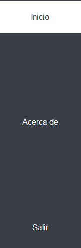
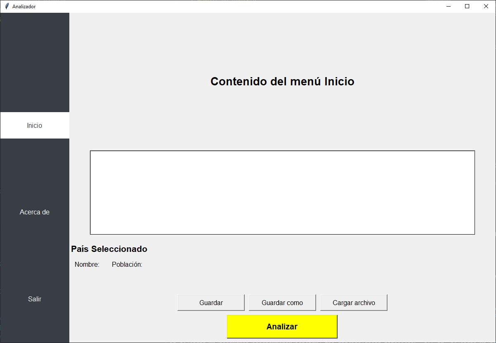
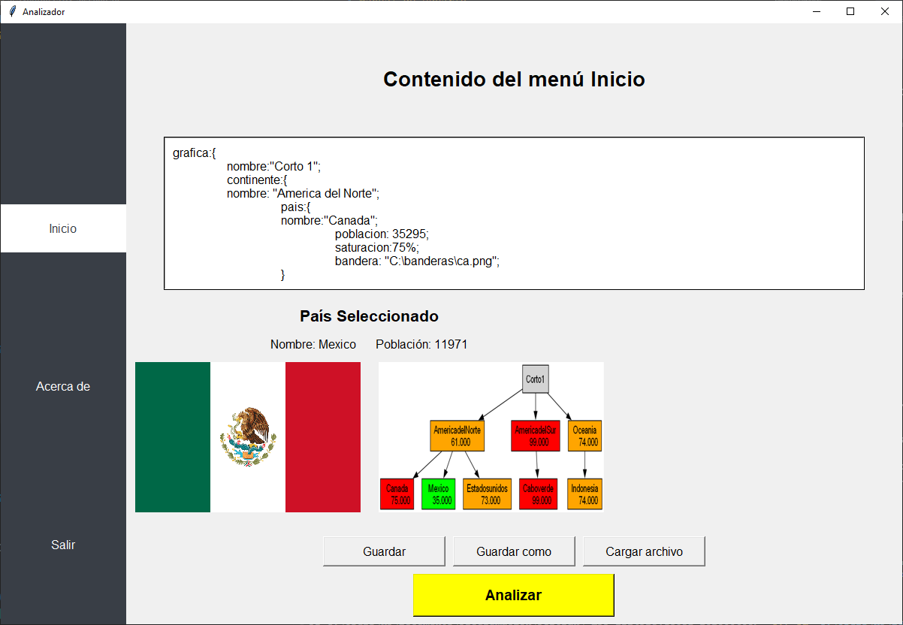
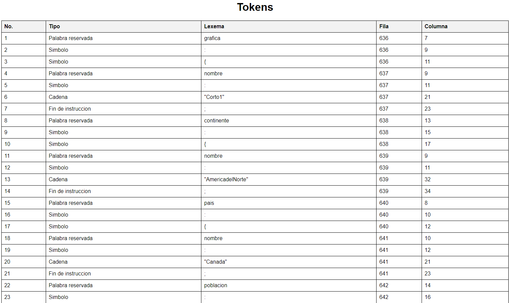
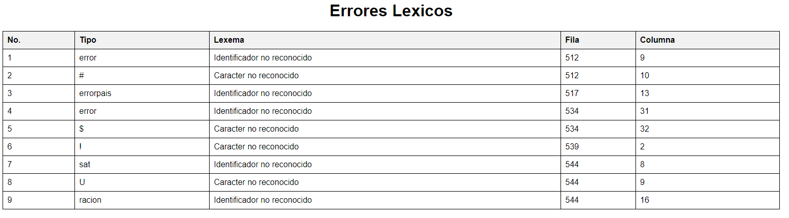

# Manual de Usuario

## Introducción

El presente manual de usuario está diseñado para guiar paso a paso la instalación y uso de la aplicación desarrollada como parte del Proyecto No. 1 del curso de Lenguajes Formales y de Programación. Este proyecto tiene como objetivo principal la implementación de una aplicación que permita a una empresa internacional seleccionar el mejor destino para abrir una nueva oficina, basándose en datos geográficos y de saturación de mercado.

La aplicación procesa archivos con extensión .ORG, los cuales contienen información jerárquica de continentes, países y su nivel de saturación de mercado. Mediante el uso del lenguaje de programación Fortran para el análisis léxico y la biblioteca Tkinter de Python para la interfaz gráfica, el programa permite visualizar gráficamente los posibles destinos y seleccionar el más óptimo con base en ciertos criterios predefinidos.

Este manual explica detalladamente el proceso de instalación, los componentes clave de la aplicación, y cómo realizar las operaciones principales, asegurando que el usuario pueda interactuar correctamente con la aplicación y entender su funcionamiento básico.

## Interfaz del Programa

La interfaz del programa está dividida en dos secciones principales:

1. **Barra de Navegación (NavBar)**
2. **Contenido Principal**

### Barra de Navegación (NavBar)

La barra de navegación se encuentra en el lado izquierdo de la ventana y contiene los siguientes botones:

- **Inicio**: Muestra el contenido principal del menú de inicio.
- **Acerca de**: Muestra información sobre el autor del programa.
- **Salir**: Cierra el programa.

### Contenido Principal

El contenido principal se encuentra en el lado derecho de la ventana y cambia según el botón seleccionado en la barra de navegación.

#### Menú Inicio

Cuando se selecciona el botón "Inicio", se muestra el siguiente contenido:

- **Área de Texto**: Un campo de texto donde se puede ingresar o cargar contenido desde un archivo.
- **Información del País Seleccionado**: Muestra el nombre y la población del país seleccionado, así como imágenes relacionadas.
- **Botones de Acción**:
  - **Guardar**: Guarda el contenido del área de texto en el archivo actual.
  - **Guardar como**: Guarda el contenido del área de texto en un nuevo archivo.
  - **Cargar archivo**: Permite cargar contenido desde un archivo de texto.
  - **Analizar**: Envía el contenido del área de texto para su análisis y muestra los resultados.

### Funcionalidades Principales

#### Cargar Archivo

1. Haga clic en el botón "Cargar archivo".
2. Seleccione el archivo de texto que desea cargar.
3. El contenido del archivo se mostrará en el área de texto.

#### Guardar Archivo

1. Haga clic en el botón "Guardar" para guardar el contenido en el archivo actual.
2. Haga clic en el botón "Guardar como" para guardar el contenido en un nuevo archivo.

#### Analizar Contenido

1. Ingrese o cargue el contenido en el área de texto.
2. Haga clic en el botón "Analizar".
3. Los resultados del análisis se mostrarán en la sección de información del país seleccionado, ademas de mostrar la bandera.
4. Para tener un mayor analis se desplegara una grafica descriptiba de la situcion de los paises y la saturacion del continente

5. Teniendo un mejor control para un reporte del analisis se generara una archivo html llamado "output" la cual tendra en su contenido una tabla de todos los tokens reconocidos del archivo

6. En caso el archivo a analizar no este bien estrucuturado o no contenga las palabras establecidas se geenrar un html con el nombre "output" el cual se trata de una pagina web con una tabla con todos lo errores que este archivo dispone

### Información Adicional

#### Acerca de

Al hacer clic en el botón "Acerca de", se muestra un cuadro de diálogo con la siguiente información:

- Estudiante: Diego Alejandro Vásquez Alonzo
- Carné: 202300638
- Curso: Lenguajes Formales y de Programación
- Sección: B+

#### Salir

Para cerrar el programa, haga clic en el botón "Salir".
